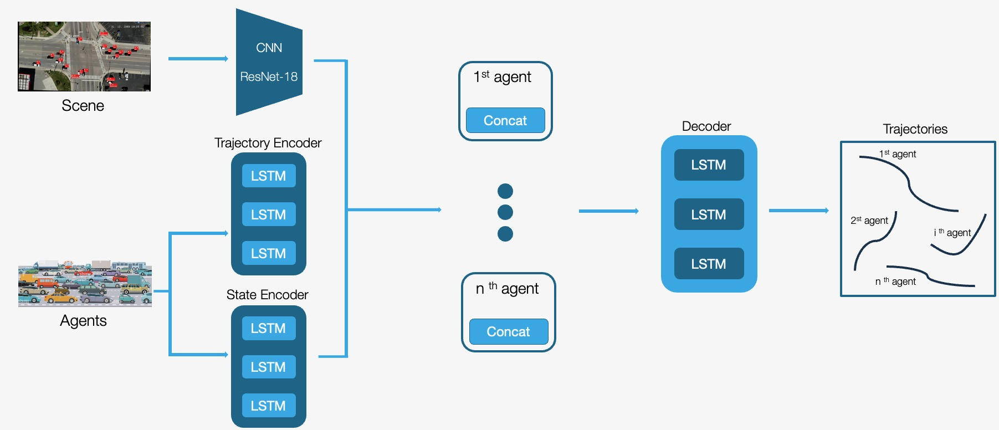
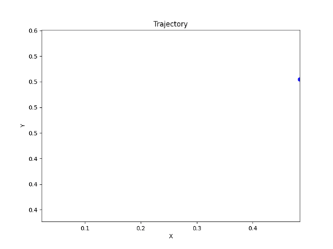
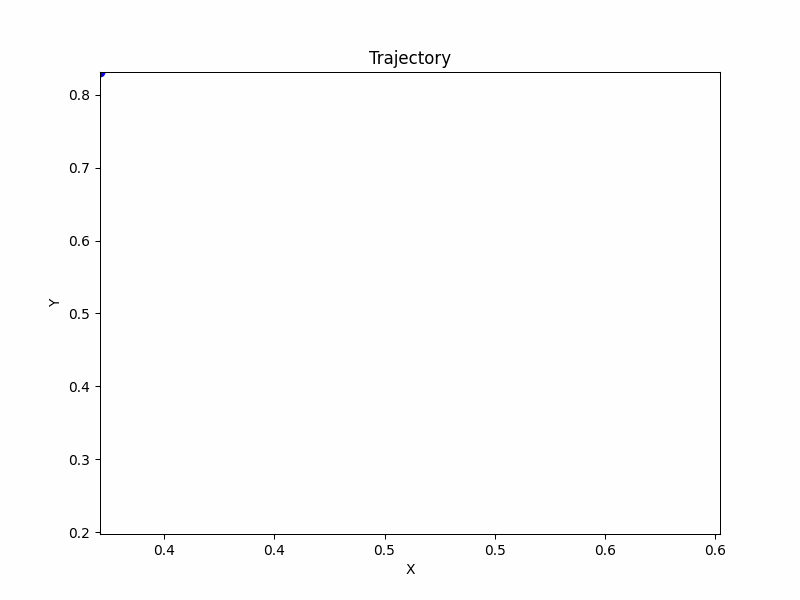

# PBSC (Physical Behavior Scene Contex): LSTM-based model for Vehicle Trajectory Prediction
This repo contains python notebook used to preprocess the Waterloo multi-agent traffic intersection dataset and to create and train the model or load our trained model.

## Abstract
Nowadays autonomous vehicles together with trajectory prediction represent a burgeoning field in AI. Vehicle Trajectory Prediction is essential for efficient and safe navigation, especially when considering traffic condition in urban centers. 
In the last years, simple models have been developed to predict vehicles trajectories using just physical laws, but more recent researches have attempted to include also interactions between the agents and the environment involving informations related to the agent’s state.
In this study we propose a trajectory prediction model that reflects both physical behavior and scene context information. The model considers agents' past state information, as well as their trajectory positions. Combining the results of a deep-learning solution with the results of a multilayer LSTM, the model takes care of a huge amount of information to predict the better trajectory.
The train and evaluation of the model are based on a part of the Waterloo multi-agent traffic intersection dataset, which provides multi-agent informations and Bird’s Eye View scenes for urban intersection situations.
## Dataset
The videos from the Waterloo multi-agent traffic intersection dataset were divided into frames with a sampling rate of 3Hz (a tenth of the video frame rate). After a preprocessing phase of the dataset, this is the obtained structure of the data, considering 12 points as observed trajectory and 5 to be predicted.
|TRACK_ID|First_Last_Timestamps|Frame|X-110,Y-110|...| X,Y|...| X+50,Y+50| STATUS-110|...|STATUS|STATUS+50|
|--------|:-------------------:|:---:|:---------:|---|:--:|---|:--------:|:---------:|---|:----:|:-------:|
|93|(83.083, 88.755333)|769_frame2610.jpg|(538857.67, 4813989.59)|...| (538844.67, 4814009.67)|...| (538835.71, 4814022.95)|(9.7034, 1.914, 0.3481, 2.207)|...|(32.2293, 1.0497, -0.0924, 2.1672)|(36.1521, 0.7201, -0.3222, 2.174)|
## Model
The model processes the context scene through a Resnet-18 CNN and the stati and observed trajectories information are processed by an LSTM encoder each. The concatenation of each output is processed by an LSTM decoder which predicts the trajectories.

  

## Results

|  |  |  |
|---|---|---|
| Observed Trajectory | Predicted Trajectory | Target Trajectory |

  <table style="border-collapse: collapse; border: none;">
    <tr style="border: none;">
      <td style="border: none;"></td>
      <td style="border: none;"></td>
    </tr>
  </table>

Considering that minmax normalization has been applied on the data, the ADE loss on the training set is 0.0510 while in test set is 0.1605.

## How to run the code

### Data preparation
The files needed to run this section of the notebook are: 
* Videos available in [University of Waterloo website](https://uwaterloo.ca/waterloo-intelligent-systems-engineering-lab/datasets/waterloo-multi-agent-traffic-dataset-intersection)
* [csv files](./CSV_files) with the information of each agent in each video created by us.

In the filtering subsection, you can choose the length of the predicted trajectory (in terms of tuples coordinates). In our work it was set to 5, since it allows to use the maximum number of entries with the same input and target length.
You can change the number of videos for testing (we used only one video).

This part can be skipped and use the final data provided in [dataset](./dataset).
### Training
The files needed to run this section of the notebook are: 
* [frames](https://drive.google.com/drive/folders/1MS6roGw7t24WAnHc7s5H4joBZmns2XLT?usp=share_link)
* [testing frames](https://drive.google.com/drive/folders/15rJ2vdA_FixUR9XmhLteoH40KRzPFgLx?usp=share_link)
* [csv files](./dataset/) containing the filtered trajectories for train and test
* [Resnet-18 model](https://drive.google.com/drive/folders/1bXfQoo-zBRdioUYNiTgAJst3Rz4f-bQx?usp=share_link)

Execute the "Normalization" section of the notebook, create the dataloaders, inizialize the model and training classes and start the training.

### Testing
You can load the [model](https://drive.google.com/drive/folders/1bXfQoo-zBRdioUYNiTgAJst3Rz4f-bQx?usp=share_link) and evaluate it on the test dataloader.

## Authors
[Fabrizio Italia](https://github.com/fabrizio-18), [Stefano D'Urso](https://github.com/stefa350), [Vincenzo Crisà](https://github.com/crisa11)

## References
Deep Learning-Based Multimodal Trajectory Prediction with Traffic Light, *Seoyoung Lee ,Hyogyeong Park , Yeonhwi You , Sungjung Yong and Il-Young Moon* [\[1\]](https://www.mdpi.com/2076-3417/13/22/12339)

Social GAN: Socially Acceptable Trajectories with Generative Adversarial Networks, *Agrim Gupta, Justin Johnson, Fei-Fei Li, Silvio Savarese, Alexandre Alahi* [\[2\]](https://github.com/agrimgupta92/sgan/tree/master)

Theory to Practice: LSTM and Transformers | PyTorch, *VSINGHSAN* [\[3\]](https://www.kaggle.com/code/tronrover/theory-to-practice-lstm-and-transformers-pytorch)
